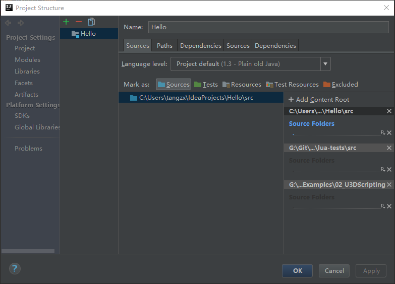
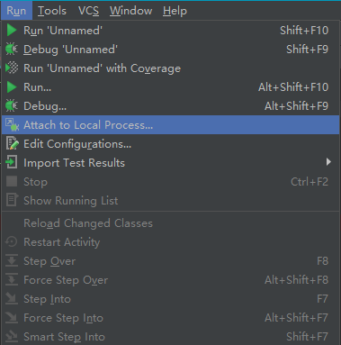
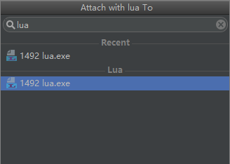
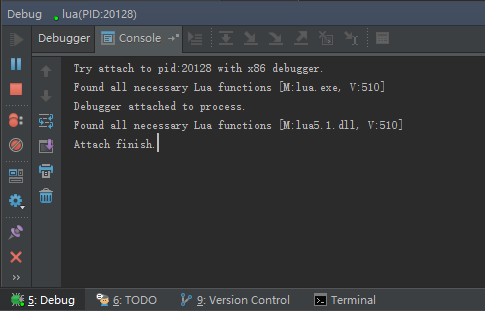
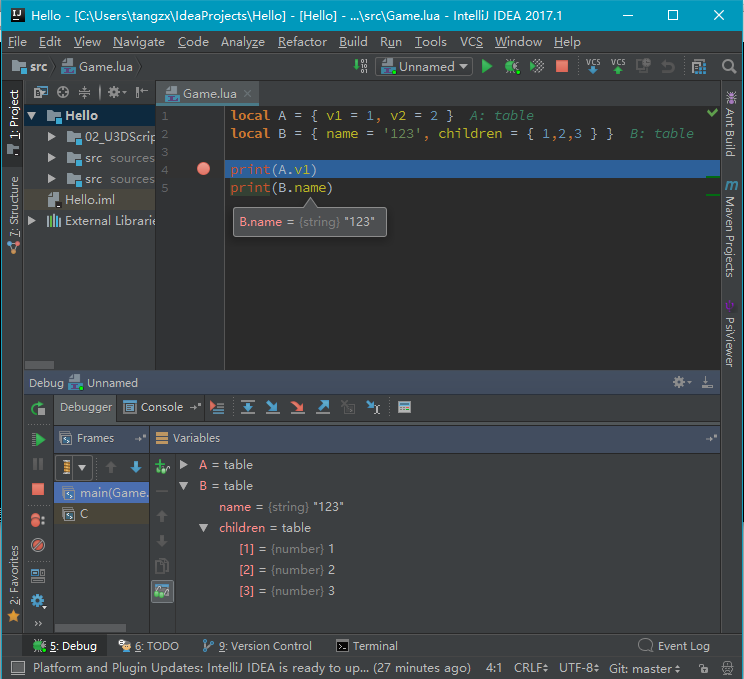
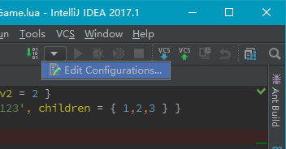
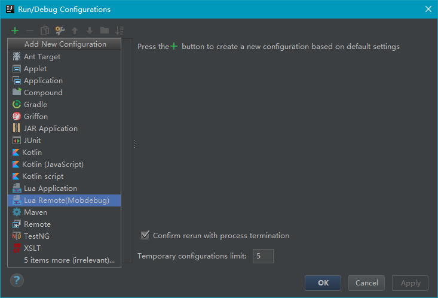
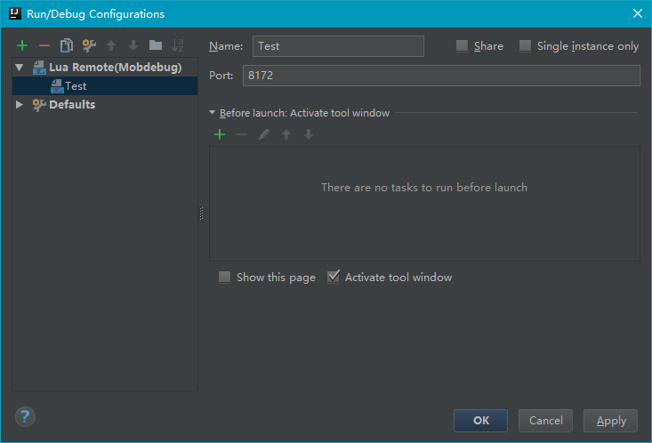
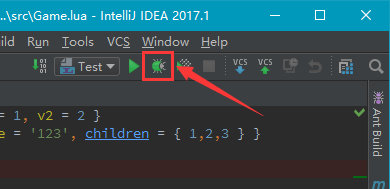
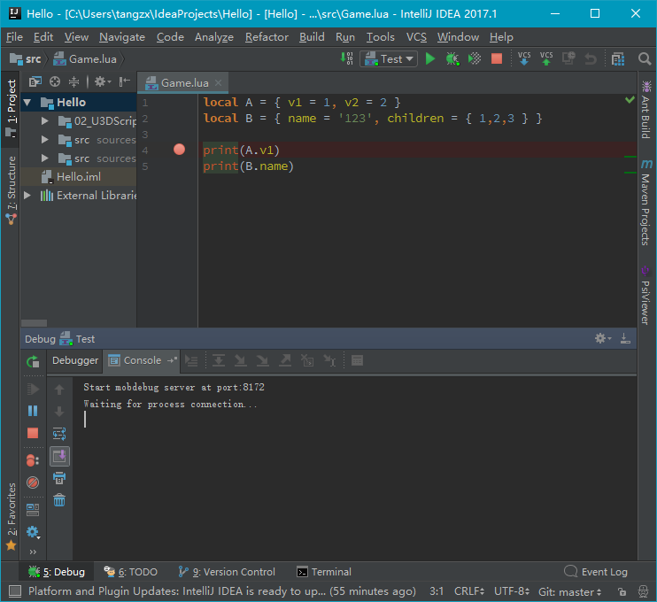

# EmmyLua调试功能

## 1. 准备

### 1.1 确认Sources目录设置正确

> 必须将源码的根目录设置为`Sources`目录
>
> 具体做法是打开菜单`File`->`Project Structure`打开`Project Structure`设置面板，点击右侧的`Add Content Root`来添加你的源码根目录，然后点击`Mark as Sources`标记



## 2. Attach Debug(Windows only)

> 说明：附加调试目前只能在`Windows`平台上使用，可以附加到32位和64位应用程序，因附加调试需将EmmyLua的调试模块`LuaInject.dll`注入到被调试程序进程中，一些杀毒软件、某卫士可能会弹窗报警告，如果注入过程被拦截则会出现注入失败的错误，导致调试失败。所以一定要选择放行或信任。


### 2.1 执行步骤

* 运行目标程序，打开IDEA菜单`Run`->`Attach to Local Process...`

  

* 选择目标程序

  

*  注意控制台LOG，出现下图LOG表明附加成功

   

* 然后就可以在源码中添加断点进行调试了

   

 ### 2.2 失败相关问题排查

* 断点无效， IDEA控制台窗口出现 `xxx not found`日志

  > 请确认`Sources` 目录设置正确

* 附加到目标程序失败，出现`Error: LuaInject.dll could not be loaded into the process`

  > 检查是否被杀软、安全卫士拦截了注入过程

## 3. Remote Debug(远程调试)

> 说明：远程调试通信基于socket，内核基于mobdebug.lua ，依赖于luasocket模块，所以被调试的程序需要支持luasocket
> 远程调试 要先启动，再启动目标程序

### 3.1 执行步骤

* 配置Remote调试设置，点击右上角`Edit Configurations`
  
* 点击`+`选择并创建`Lua Remote(Mobdebug)`配置
  
* 设置好相关参数后点击OK
  
* 点击右上角debug按钮
  
* 注意IDEA控制台LOG输出，如下图所示表示启动
  
* 下载`mobdebug.lua`并在目标程序的lua代码入口处添加代码
```lua
require("mobdebug").start()
```
* 最后启动目标程序，并注意IDEA控制台窗口，出现下图所示`Connected`则表示调试器连接成功并可以添加断点并调试了
  

###3.2 失败相关问题排查

* 运行目标程序后控制台并没有出现`Connected`日志

  > * 确认目标程序包含luasocket模块
  > * 确认调试端口一致（默认是8172端口）

* `Connected`日志有，但断点无效

  > * 检查`Sources`目录设置正确
  >
  > * 检查目标程序在运行时提供的文件名与源码文件的文件名一致（致少除了后缀名的前面的部分一致）
  >
  >   > 此项检查快捷方式是在`mobdebug.lua`的
  >   > ```lua
  >   > local function has_breakpoint(file, line)
  >   > ```
  >   > 函数中打印输出`file`

## 3.3 Lua Application 调试

